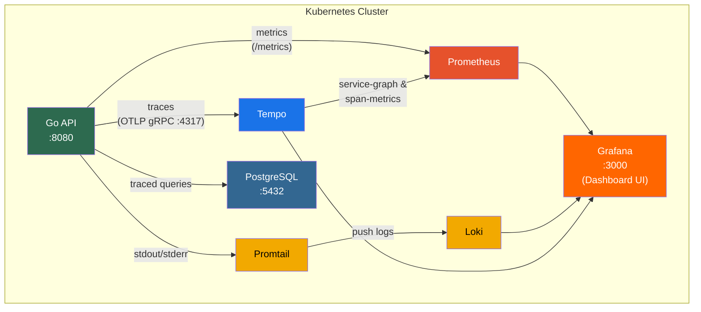
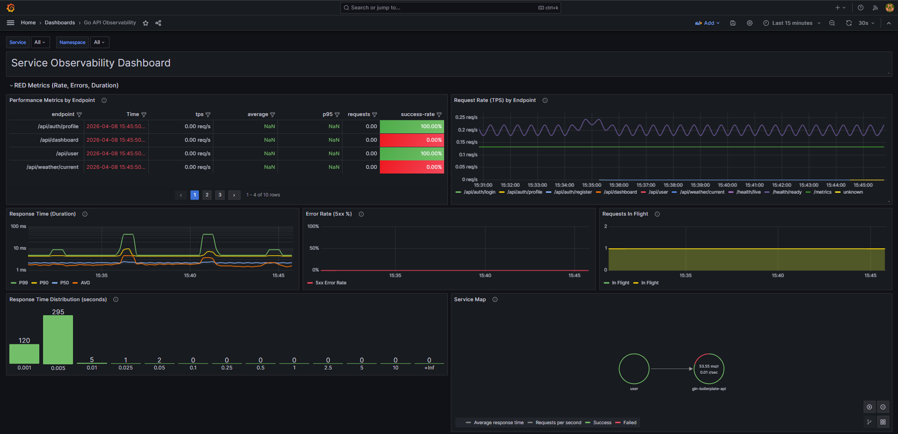
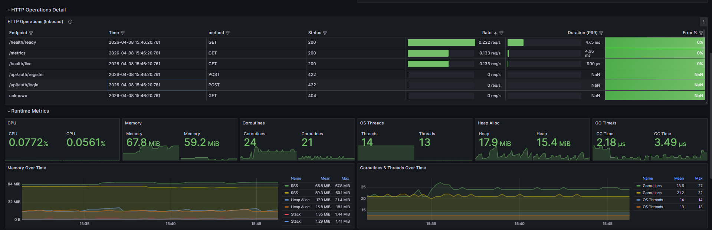
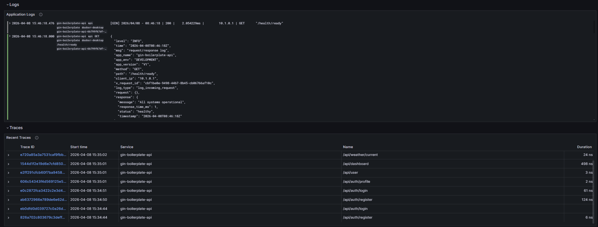
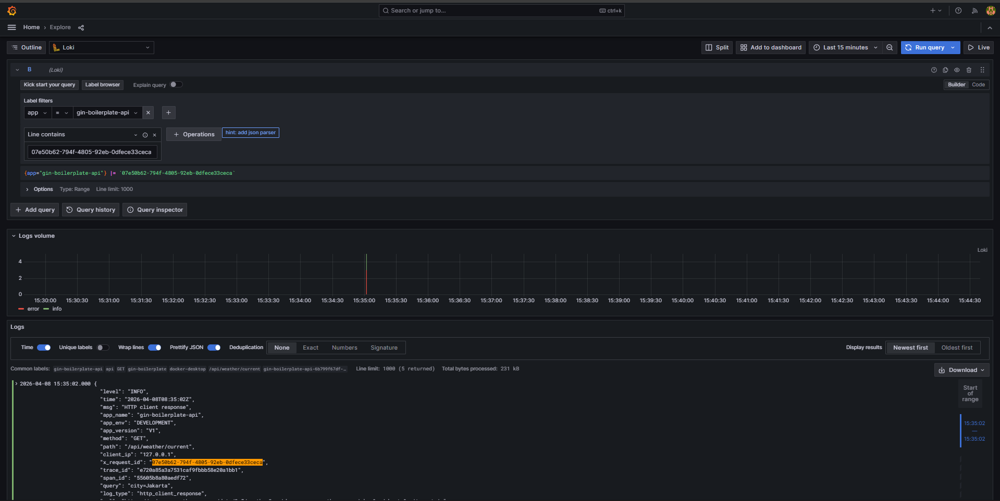
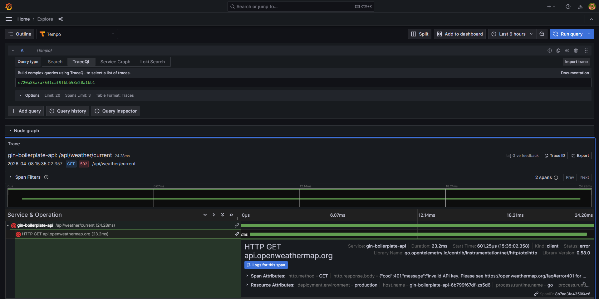

# Grafana Observability Stack: Overview & Business Value

---

## 1. Apa Itu Observability Stack?

Observability stack adalah kumpulan tools yang terintegrasi untuk **memantau, men-debug, dan memahami perilaku sistem** secara real-time. Berbeda dengan monitoring tradisional yang hanya memberi tahu *"ada masalah"*, observability membantu menjawab pertanyaan *"mengapa masalah ini terjadi"* tanpa perlu mendeploy kode baru.

Stack ini dibangun di atas **Grafana ecosystem** yang merupakan standar industri untuk observability di lingkungan cloud-native dan Kubernetes.

---

## 2. Komponen & Fungsinya

### Tiga Pilar Observability

| Pilar | Tool | Fungsi |
|-------|------|--------|
| **Metrics** | Prometheus | Mengumpulkan data numerik (request rate, error rate, latency, CPU, memory) secara periodik dan menyimpannya sebagai time-series |
| **Logs** | Loki + Promtail | Mengumpulkan dan mengagregasi log dari seluruh service. Promtail sebagai agent yang mengirim log ke Loki |
| **Traces** | Tempo | Merekam perjalanan sebuah request dari awal hingga akhir, termasuk semua service dan database yang dilewati |

### Komponen Pendukung

| Tool | Fungsi |
|------|--------|
| **Grafana** | Dashboard terpusat untuk visualisasi metrics, logs, dan traces. Satu tempat untuk semua data observability |
| **Promtail** | Agent yang berjalan di setiap node Kubernetes, otomatis mengumpulkan log dari semua container |
| **PostgreSQL** | Database untuk menyimpan data aplikasi, dengan query yang secara otomatis di-trace |

### Diagram Arsitektur

---

## 3. Mengapa Kita Membutuhkan Ini?

### Problem yang Diselesaikan

| Situasi Sebelumnya | Dengan Observability Stack |
|----|-----|
| Debug production issue dengan `kubectl logs` manual satu-satu pod | Log dari **semua pod** terkumpul di Loki, bisa di-search dan di-filter secara real-time dari Grafana |
| Tidak tahu kenapa sebuah API lambat | Tempo menunjukkan **breakdown waktu** di setiap layer: HTTP handler → database query → external API call |
| Masalah baru diketahui setelah user komplain | Prometheus alert **otomatis mendeteksi** error rate tinggi, latency naik, atau pod down dalam hitungan menit |
| Sulit menghubungkan log, metrics, dan trace dari request yang sama | Setiap request punya **trace ID** yang menghubungkan log, metrics, dan trace di Grafana |
| Tidak ada data historis untuk analisa trend | Metrics disimpan **15 hari**, logs **7 hari**, semua bisa di-query untuk analisa trend |

### Skenario Nyata

**Skenario: API `/api/dashboard` response time naik dari 200ms ke 3 detik**

1. **Prometheus** alert `HighLatency` ter-trigger → notifikasi ke tim
2. Buka **Grafana dashboard** → lihat metrics: request duration naik drastis mulai jam 14:00
3. Klik trace dari request yang lambat di **Tempo** → terlihat external API call ke weather service timeout 2.5 detik
4. Korelasi ke **Loki** logs dengan trace ID yang sama → terlihat error `"connection timeout to api.openweathermap.org"`
5. **Root cause** ditemukan dalam 5 menit, tanpa perlu SSH ke server

---

## 4. Apa yang Bisa Dilihat di Dashboard?

### Service Observability Dashboard

Dashboard utama menampilkan **RED Metrics** (Rate, Errors, Duration) untuk setiap endpoint:

- **Request Rate (RPS)** per endpoint — mengetahui traffic pattern
- **Error Rate** — persentase request yang gagal (5xx)
- **Response Time Distribution** — histogram latency untuk mengidentifikasi outlier
- **Requests in Flight** — jumlah request yang sedang diproses secara bersamaan
- **Service Map** — visualisasi dependensi antar service

### Runtime & HTTP Operations Detail

Detail operasional meliputi:

- **HTTP Operations table** — detail setiap endpoint (method, status, duration)
- **Runtime Metrics** — memory usage, goroutine count, GC statistics
- **Memory & Goroutine trends** — untuk mendeteksi memory leak atau goroutine leak

### Logs & Traces Correlation

Integrasi logs dan traces dalam satu view:

- **Application Logs** — structured JSON logs yang bisa di-filter dan di-search
- **Recent Traces** — daftar trace terbaru dengan link langsung ke detail trace
- Setiap log entry dan trace saling terhubung melalui **trace ID**

### Log Exploration (Loki)

Explore logs secara interaktif:

- Filter berdasarkan label: app, namespace, level, method, path
- Full-text search di seluruh log content
- Log volume timeline untuk melihat pattern
- Detail view dengan structured JSON fields termasuk trace context

### Distributed Tracing (Tempo)

Visualisasi trace menunjukkan:

- **Waterfall timeline** — urutan dan durasi setiap span dalam satu request
- **Cross-service calls** — terlihat saat request memanggil external API
- **Span attributes** — detail seperti HTTP method, URL, status code, error message
- **Node graph** — visualisasi topologi service

---

## 5. Keunggulan Stack Ini

### Teknis

| Keunggulan | Detail |
|-----------|--------|
| **Korelasi otomatis** | Trace ID menghubungkan metrics, logs, dan traces. Klik dari alert → dashboard → trace → log dalam satu alur |
| **Auto-discovery** | Prometheus otomatis menemukan dan scrape metrics dari pod baru. Promtail otomatis mengumpulkan log dari semua container |
| **Pre-configured alerts** | Alerting rules siap pakai: error rate tinggi, latency tinggi, pod down, memory/CPU usage tinggi, panic recovery |
| **Database query tracing** | Setiap SQL query ke PostgreSQL otomatis tercatat di trace, termasuk durasi dan error |
| **External call tracing** | HTTP call ke service lain (weather API, dsb.) otomatis di-trace dengan detail request/response |
| **Structured logging** | Log dalam format JSON terstruktur, memudahkan filtering dan analisa dibanding log text biasa |

### Operasional

| Keunggulan | Detail |
|-----------|--------|
| **Open-source** | Seluruh stack berbasis open-source (Grafana, Prometheus, Loki, Tempo). Tidak ada vendor lock-in atau biaya lisensi |
| **Kubernetes-native** | Didesain untuk Kubernetes: DaemonSet untuk log collection, auto-discovery via label/annotation, health checks terintegrasi |
| **Resource-efficient** | Loki mengindex label saja (bukan full-text), jauh lebih hemat storage dibanding ELK stack. Tempo menggunakan object storage yang murah |
| **Scalable** | Setiap komponen bisa di-scale secara independen sesuai kebutuhan |
| **Standardized** | Menggunakan OpenTelemetry (standar CNCF) untuk tracing — mudah diadopsi oleh service lain |
| **Deployment sederhana** | Satu command `kubectl apply -k k8s/` untuk deploy seluruh stack |

### Dibanding Alternatif Lain

| Aspek | Stack Ini (Grafana) | ELK Stack | Datadog / New Relic |
|-------|-------------------|-----------|---------------------|
| **Biaya** | Gratis (open-source) | Gratis tapi resource-heavy | Berbayar (bisa sangat mahal di scale besar) |
| **Storage efficiency** | Tinggi (Loki index label only) | Rendah (full-text index) | N/A (managed) |
| **Tracing** | Built-in (Tempo) | Perlu tambahan (Jaeger/Zipkin) | Built-in |
| **Setup complexity** | Sedang | Tinggi | Rendah (SaaS) |
| **Vendor lock-in** | Tidak ada | Tidak ada | Tinggi |
| **Kubernetes support** | Native | Perlu konfigurasi | Agent-based |
| **Community** | Sangat besar (CNCF) | Besar | Terbatas (proprietary) |

---

## 6. Integrasi dengan Service Baru

Untuk mengintegrasikan service baru ke observability stack, developer hanya perlu:

1. **Metrics** — Expose endpoint `/metrics` dan tambahkan annotation Prometheus di pod spec
2. **Logging** — Output log dalam format JSON ke stdout (Promtail otomatis mengumpulkan)
3. **Tracing** — Tambahkan OpenTelemetry SDK dan arahkan ke Tempo endpoint

Contoh implementasi lengkap tersedia di project **go-gin-boilerplate** yang sudah terintegrasi penuh dengan stack ini.

---

## 7. Roadmap & Rekomendasi

| Prioritas | Item | Manfaat |
|-----------|------|---------|
| Tinggi | Integrasi alerting ke Slack/Google Chat | Notifikasi real-time saat ada masalah |
| Tinggi | Onboarding semua production service | Full visibility seluruh sistem |
| Sedang | Setup Grafana OnCall | Automated incident management & escalation |
| Sedang | Custom dashboards per squad | Setiap tim punya dashboard sesuai kebutuhan |
| Rendah | Long-term storage (S3/GCS) | Retensi data lebih lama dengan biaya rendah |
